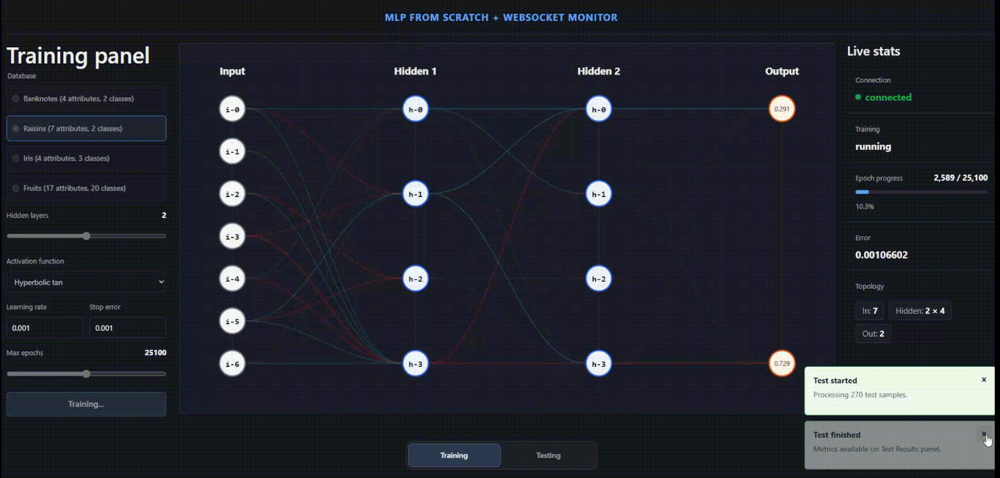

# MLP From Scratch — Live Training Monitor

<!-- Replace `docs/demo.gif` with a recorded walkthrough of the application. -->


An interactive web application for training a **Multi-Layer Perceptron (MLP)** implemented from scratch and observing its behavior in real time. Configure the network and training parameters, watch its topology, weights, outputs, and error evolve, then evaluate the resulting model with a confusion matrix and classification metrics.

## Highlights

- Train an in-house MLP implementation against bundled classification datasets.
- Configure the dataset, hidden-layer count, activation function, learning rate, stop error, and maximum epochs.
- Follow training live through topology, connection weights, output values, epoch progress, and network error.
- Run a test after training and inspect the confusion matrix, accuracy, precision, recall, and F1 score.
- Keep the UI synchronized through STOMP over WebSocket.
- Run the complete stack with Docker Compose.

## Architecture

```text
React + TypeScript + Vite
        |  HTTP: create training/test sessions
        |  WebSocket/STOMP: commands and live events
        v
Java 17 + Spring Boot API
        |
        v
MLP implementation, datasets, training sessions, and test services
```

The frontend opens a training or test session through HTTP. It then connects to the API's WebSocket endpoint to send commands and receive live events while the backend performs training or testing.

## Tech Stack

| Area | Technologies |
| --- | --- |
| Frontend | React 19, TypeScript, Vite, SVG |
| Backend | Java 17, Spring Boot, Maven |
| Real-time communication | WebSocket, STOMP |
| Data processing | Tablesaw |
| Containerization | Docker and Docker Compose |

## Quick Start

### Requirements

- Docker and Docker Compose

### Development

From the repository root, start the API and the Vite development server:

```bash
./run_dev.sh
```

On Windows PowerShell:

```powershell
.\run_dev.ps1
```

Then open [http://localhost:5173](http://localhost:5173). The API is exposed at `http://localhost:8080`.

The development Compose configuration mounts the frontend source into a Node 22 container and starts Vite with hot reload. The API is rebuilt from the local `api` directory.

### Stop the stack

```bash
docker compose -f docker-compose.yml -f docker-compose.dev.yml down
```

## How to Use It

1. Open the **Training** view.
2. Choose a dataset and configure the hidden layers, activation function, learning rate, stop error, and epoch limit.
3. Select **Start training**.
4. Monitor the live topology, weights, outputs, progress, and network error.
5. When the session finishes, switch to **Testing**.
6. Start a test for the completed training session and review the confusion matrix and metrics.

## Included Datasets

| Dataset | Attributes | Classes |
| --- | ---: | ---: |
| Banknotes | 4 | 2 |
| Raisins | 7 | 2 |
| Iris | 4 | 3 |
| Fruits | 17 | 20 |

CSV files are located in [`api/src/main/resources/data`](api/src/main/resources/data).

## API and Real-Time Protocol

The following public endpoints create the sessions that the frontend uses:

| Method | Path | Purpose |
| --- | --- | --- |
| `POST` | `/api/mlp/sessions/train` | Creates a training session. |
| `POST` | `/api/mlp/sessions/test` | Creates a test session for a finished training session. |

The STOMP endpoint is `/ws`. Client commands are sent to the `/app` prefix and events are published under `/topic`.

| Direction | Destination | Purpose |
| --- | --- | --- |
| Client → API | `/app/mlp/start` | Starts a training session with its configuration. |
| API → Client | `/topic/mlp/{sessionId}/status` | Streams training status, progress, outputs, weights, and completion events. |
| Client → API | `/app/mlp/tests/{testSessionId}/start` | Starts a test session. |
| API → Client | `/topic/mlp/tests/{testSessionId}` | Streams test progress and final metrics. |

## Configuration

Copy the relevant example environment file before changing runtime settings:

```bash
cp .env.example .env
cp api/.env.example api/.env
cp frontend/.env.example frontend/.env
```

The key settings are:

| Variable | Used by | Description |
| --- | --- | --- |
| `FRONTEND_ORIGIN` | API | Browser origins allowed by CORS and WebSocket. |
| `VITE_API_BASE_URL` | Frontend | Public base URL for the API. |
| `VITE_API_PROXY_TARGET` | Frontend development | API target used by Vite's development proxy. |
| `MLP_TRAINING_MAX_RUNNING_DURATION_MS` | API | Maximum duration allowed for a running training session. |
| `MLP_TRAINING_MAX_SESSIONS` | API | Maximum number of managed training sessions. |

## Production Deployment

Production uses Traefik routing. Configure `APP_DOMAIN`, `API_DOMAIN`, `FRONTEND_ORIGIN`, and the Traefik variables in `.env`, then run:

```bash
./run_prod.sh
```

The production Compose configuration expects the external Traefik network identified by `TRAEFIK_NETWORK` (default: `traefik_proxy`) to exist.

## Verification Commands

Run frontend checks from `frontend`:

```bash
npm ci
npm run lint
npm run build
```

Run backend tests from `api`:

```bash
./mvnw test
```

On Windows, use `mvnw.cmd test`.

## Project Structure

```text
.
├── api/                 # Spring Boot API and MLP implementation
│   └── src/main/resources/data/  # Bundled CSV datasets
├── frontend/            # React application and visualizations
├── docker-compose.yml   # Base stack
├── docker-compose.dev.yml
├── docker-compose.prod.yml
├── run_dev.sh
└── run_prod.sh
```

## Current Scope

This project is intended as an interactive learning and portfolio application. Training sessions and trained models are managed in memory, so they are not retained after the API restarts.

## License

This project is licensed under the [MIT License](LICENSE).
